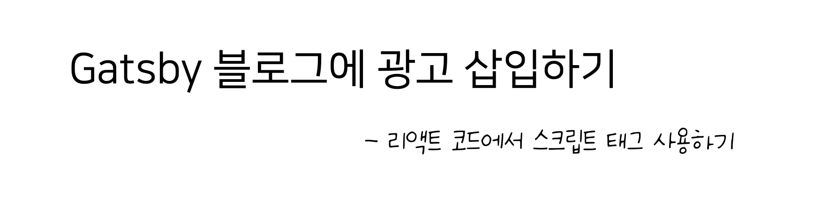
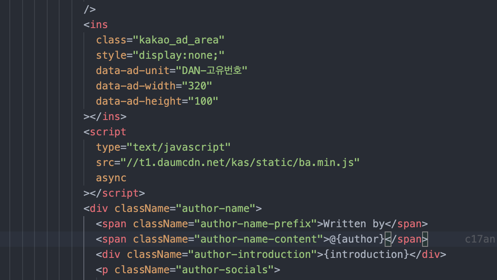
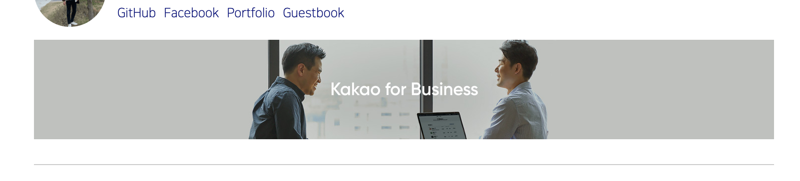

## 1. 개츠비는?

개츠비를 다른 프레임워크와 비교했을 때 가장 큰 특징은 `react.js` 기반의 페이지를 호스팅한다는 점인데요, 자바스크립트를 사용하는 분들이라면 쌍수 들고 환영할 일이지만 이로 인한 어려움도 일부 존재합니다.

그중 대표적인 문제가 바로 '광고' 인데요, 오늘은 저와 함께 블로그에 애드핏 광고를 넣어 봅시다!!

## 2. 애드핏과 스크립트 태그

저는 어쩌다 보니 애드센스 블럭을 당해 카카오 애드핏을 사용하고 있는데요, 여기 애드핏 샘플 코드가 있습니다.

```html
<ins
  class="kakao_ad_area"
  style="display:none;"
  data-ad-unit="DAN-고유번호"
  data-ad-width="320"
  data-ad-height="100"
></ins>
<script
  type="text/javascript"
  src="//t1.daumcdn.net/kas/static/ba.min.js"
  async
></script>
```

지킬이나 다른 프레임워크를 사용한다면 그냥 `footer.html` 같은 파일을 찾아 코드를 집어넣으면 되겠지만, 모든 페이지를 자바스크립트로 구성하는 개츠비에서는 `<script>` 태그를 사용할 곳이 여의치 않다는 문제가 생깁니다.



<div style = "text-align: center; margin-bottom: 1rem; font-size: 0.8rem">이렇게 리액트 컴포넌트 내에 직접 스크립트 태그를 삽입하면, 아무것도 뜨지 않아요</div>

그럼 개츠비 블로거는 광고로 부자가 될 방법이 없는 걸까요? 😂

## 3. react-script-tag 사용하기

너무 상심하지 마세요!  
`react-script-tag` 라이브러리가 이런 상황의 답이 될 수 있는데요, 한번 같이 사용해 봅시다.

```
npm i react-script-tag
```

먼저 npm을 사용해 패키지를 사용해준 뒤 광고를 넣고자 하는 컴포넌트에 들어갑니다.

```js
import ScriptTag from 'react-script-tag'
```

그 후, 최상단에서 패키지를 불러온 다음 광고 태그를 이렇게 변경합니다.

```html
<ins
  class="kakao_ad_area"
  style="display:none;"
  data-ad-unit="DAN-고유번호"
  data-ad-width="320"
  data-ad-height="100"
></ins>
<!-- 기존 <script> 태그를 <ScriptTag> 로 변경한 모습입니다. -->
<ScriptTag
  type="text/javascript"
  src="//t1.daumcdn.net/kas/static/ba.min.js"
  async
></ScriptTag>
```

마지막으로 변경한 광고 코드를 원하는 영역에 집어넣으면 광고 데모가 보이는 걸 확인할 수 있습니다!



## 4. 마치며

처음 시도할 때는 `public` 폴더의 `index.html` 파일을 건드려도 보는 등 정말 요상한 시도를 많이 했었는데요, 이게 가장 깔끔한 방법이라 생각됩니다 😄

또 애드센스나 다른 광고 코드들도 아마 거의 유사한 형태일 텐데요, 마찬가지로 `script` 태그를 `ScriptTag` 로 바꾸는 법만 알고 계신다면 간단하게 광고를 넣으실 수 있을 거에요!

※ 혹시 다른 문제를 겪고 계시는 분이 계신다면 얼마든지 댓글 남겨주세요!
