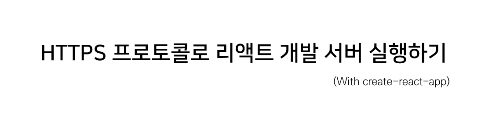

`create-react-app` 을 사용해 리액트 프로젝트를 구성하면 `npm start` 명령을 사용해 테스트 서버에서 결과물을 확인해볼 수 있다. 아마 여기까지는 대부분 아는 내용이겠지만 한 가지 재미있는 사실이 있다.  

바로 리액트 테스트 서버는 HTTP 프로토콜을 사용한다는 점인데, 이로 인해 [Mixed Content 이슈를 해결하며](https://merrily-code.netlify.app/front-end/Mixed-Content-%EC%9D%B4%EC%8A%88-%ED%95%B4%EA%B2%B0%ED%95%98%EA%B8%B0/article/) 처럼 네트워크와 관련된 문제를 개발 단계에서 캐치하지 못할 수도 있다.  

따라서 때로는 테스트 서버를 HTTPS 프로토콜로 여는 것이 도움이 되는데, 여기 그 방법을 소개한다.

<hr style = "background-color: #dedede; margin: 1.5rem 0;">

**1. CMD 사용 시**

```cmd
set HTTPS=true&&npm start
```

**2. 파워쉘 사용 시**

```cmd
($env:HTTPS = "true") -and (npm start)
```

**3. 리눅스, MacOS 사용 시**

```cmd
HTTPS=true npm start
```


사용하는 터미널에 맞게 명령어를 수행하면 자체 서명된 인증서가 포함된 HTTP 사이트로 접속하게 되며, 안전하지 않다는 경고가 출력되지만 무시하고 진행할 수 있다.