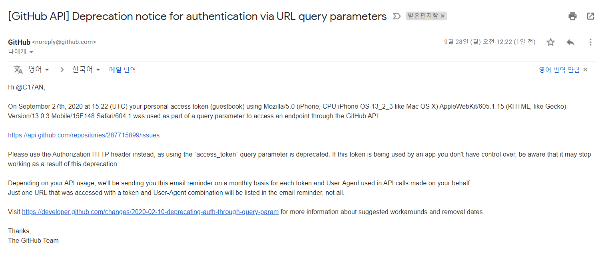
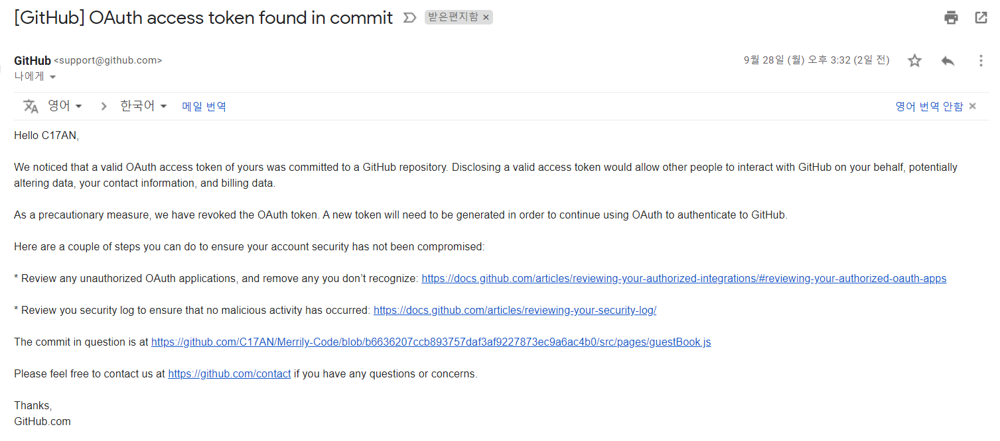
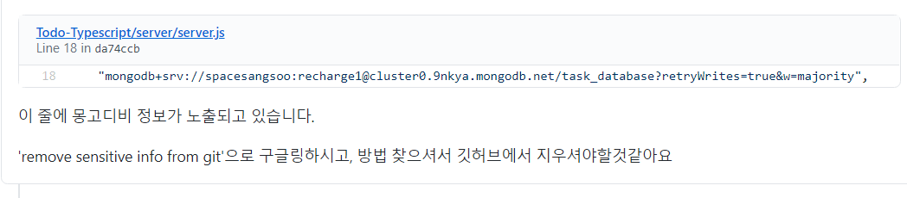
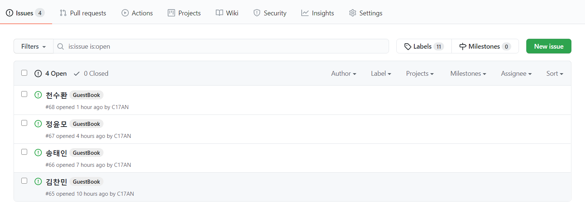
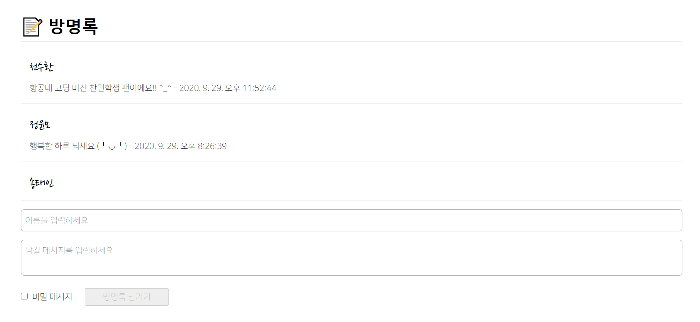
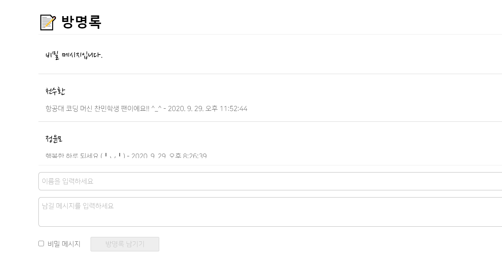

## 1. 방명록을 만들다

[**utterances**](https://github.com/utterance/utterances) 라는 저장소의 이슈를 활용한 블로그 댓글 서비스를 보고 영감을 얻어 "아, 이런 식으로 방명록을 만들면 재밌을 것 같은데?" 하고 방명록을 만든 경험을 적어보려 한다.

시작에 앞서 소개하자면 깃허브 이슈는 크게 `title(제목)`-`body(내용)`-`labels(라벨 목록)` 으로 구성되어 있는데, 이 세 가지 속성을 잘 버무려 방명록의 기능을 구현하는 것이 목표였다.

## 2. GitHub API로 이슈 다루기

우선 깃허브 이슈를 다루기 위해 깃허브 API가 필요했는데, [Github Developer](https://developer.github.com/v3) 홈페이지에 정말 자세한 문서가 있어 개발할 때 많은 도움이 되었다.

이슈를 불러오는 API는 인증 토큰 없이 GET 요청을 보내면 쉽게 목록을 받아오지만 새로운 이슈를 생성할 때는 이슈 내용과 함께 **PAT(Private Access Token)**를 포함한 POST 요청을 보내야 한다.

그런데 토큰을 어떤 형식으로 포함해 요청을 보내는지는 문서에 나와있지 않아 꽤나 애를 먹었는데, 처음에는 URL 쿼리스트링 맨 뒤에 `?access_token={암호화된 PAT}` 형식으로 요청을 보내니 겉보기엔 해결된 것 같았지만 이내 메일을 한 통 받아볼 수 있었다.



<div style = "text-align: center; margin-bottom: 1rem; font-size: 0.88rem">[대충 망했다는 내용]</div>

저렇게 쿼리스트링 방식으로 인증하는 방식은 이제 버릴거니까 HTTP 헤더 안에 토큰을 포함하라는 내용이었다.  
근데 어떻게 추가하라는지는 끝까지 안 알려줬다. ~~나쁜 깃허브 팀 같으니~~

아무튼 스택오버플로를 쥐잡듯 뒤진 끝에 헤더에 토큰을 추가할 수 있었다.

```js
fetch('https://api.github.com/repos/c17an/Merrily-Code/issues', {
  method: 'POST',
  headers: {
    'Content-Type': 'application/json',
    Authorization: `token (PAT 토큰번호)`,
  },
  body: JSON.stringify({
    title: `(이름)`,
    body: `(메시지)`,
    labels: `(라벨 - 이후 소개)`,
  }),
})
```

이후 `body` 내용대로 이슈가 생성되는 것까지 확인했고 코드를 조금 다듬어 레포에 푸시까지 마쳤다.  
그렇게 설레는 마음으로 첫 번째 방명록을 남겨 보려는 순간, <span style = "color:red">403 에러(Not Authorized)</span> 가 콘솔에 출력되었다.

로컬 환경에서 테스트할때는 전혀 보지 못했던 이슈라 당황하고 있을 때 다시 지메일 알람이 띠링 울렸다.



이번 메일은 저장소에 PAT가 발견되어 토큰 권한을 제거한다는 내용이었는데, 슬슬 머리가 아파왔다.  
"키를 저장소에 보관할 수 없으면 AWS 같은 곳에 API 서버를 만들어야 하나? 배보다 배꼽이 커지는데.." 라는 고민을 썩힐 무렵, 아주 예전에 컨트리뷰톤 멘토님이 남겨주신 피드백이 떠올랐다.



하지만 아쉽게도 내가 원하는 답은 찾을 수 없었고, 결국 새로운 시도를 하나 해보기로 했다.  
바로 깃허브 저장소가 코드에 PAT가 포함되어 있는지 검사할 때 하드코딩된 PAT만을 검사할 것이라고 가정하고 PAT를 조각으로 나눈 다음 다시 붙여서 사용하는 것이었다.

```js
fetch('https://api.github.com/repos/c17an/Merrily-Code/issues', {
    method: 'POST',
    headers: {
        'Content-Type': 'application/json',
        Authorization: `token ${토큰 조각 1}${토큰 조각 2}${토큰 조각 3}`,
    },
    body: JSON.stringify({
        title: `(이름)`,
        body: `(메시지)`,
        labels: `(라벨 - 이후 소개)`,
    }),
})
```

보안성은 저 멀리 날아간 땜질 코드긴 하지만 이것마저 안되면 말 그대로 답이 없는 상황이었다.  
하지만 다행히 결과는 성공이었고, 이제 텍스트창의 입력을 통해 새로운 이슈를 생성할 수 있게 되었다.



<div style = "text-align: center; margin-bottom: 1rem; font-size: 0.88rem">[방명록 페이지에서 생성한 이슈]</div>

## 3. 이슈 라벨 사용하기

이슈를 불러오는 과정에서도 문제가 없진 않았다.  
버그나 개선 제안등 실제 이슈에 해당하는 내용이 올라오면 이 내용들을 방명록에서 제외할 방법이 필요했는데, 이 문제는 방명록 이슈임을 의미하는 GuestBook 라벨을 만들고 해당 라벨을 가진 이슈를 필터링해 해결할 수 있었다.

```js
// 컴포넌트 마운트 시에 이슈 리스트 긁어옴
useEffect(() => {
  fetch('https://api.github.com/repos/c17an/Merrily-Code/issues')
    .then(res => res.json())
    .then(data => {
      setGuestList(
        data
          .filter(issue => {
            // 라벨이 존재하지 않거나 첫 라벨명이 'GuestBook'이 아닌 경우는 제외함.
            if (issue.labels[0] && issue.labels[0].name === 'GuestBook') {
              return true
            } else {
              return false
            }
          })
          .map(guest => {
            return {
              title: guest.title,
              body: guest.body,
              labels: guest.labels.map(label => label),
            }
          })
      )
    })
}, [])
```

이 이슈 라벨은 나중에 비밀글 기능을 추가할 때도 사용했는데, 비밀글로 설정하면 라벨 배열에 'Secret' 라벨을 추가함으로써 비밀글 로직을 처리할 수 있었다.

## 4. 완성 결과

**방명록 링크 : [방명록 둘러보기](https://merrily-code.netlify.app/guestBook)**

**구현 기능**

- 방명록 남기기
- 방명록 타임스탬프 기록
- 비밀글 기능



## 5. 아쉬운 점 여러개

어찌저찌 완성은 했지만 솔직히 아쉬운 점이 너무 많았다.

일단 코드가 더럽다.  
PAT를 코드 안에 넣은건 백 번 양보해 어쩔 수 없었다 쳐도 각각의 방명록 정보가 담긴 Guest 컴포넌트를 살펴보자.

```js
export const Guest = ({ title, message, labels }) => {
  return (
    <div className="guest">
      <h3 className="guest__name">
        {(labels[1] && labels[1].name === 'Secret') || labels[1] === 'Secret'
          ? '비밀 메시지입니다.'
          : title}
      </h3>
      <div className="guest__message">
        {(labels[1] && labels[1].name === 'Secret') || labels[1] === 'Secret'
          ? ''
          : message}
      </div>
    </div>
  )
}
```

조건문에 주목해 보면 라벨 배열 요소의 `name` 값을 검사한 다음 라벨 배열 요소의 값을 검사해 두 값이 모두 'Secret' 일 때 비밀글로 처리한다.

_왜 이런 쓸데없는 로직이 더덕더덕 붙은 코드가 탄생했을까?_

변명을 해보자면 페이지가 처음 로드될 때 `useEffect` 훅에 의해 GET 요청으로 깃허브 이슈를 불러오는데, 나는 이슈 목록을 불러오는 그 짧은 시간동안 하얀 화면이 출력되는게 너무 보기 싫었다.

그래서 새로운 방명록을 리스트에 추가할 때 `fetch`를 다시 수행하는 대신 POST 요청의 `body`에 포함된 값을 `useState` 훅으로 방명록 리스트에 추가했는데, 이 과정에서 labels 속성에 차이가 생긴다.

말로 하면 도무지 무슨 소린지 모르겠으니 코드를 보자.

```js
// 이슈 목록을 불러오는 get 요청 결과에 포함된 labels 속성
labels: Array(1)
0:
color: "ededed"
default: false
description: null
id: 2380604454
name: "GuestBook"
node_id: "MDU6TGFiZWwyMzgwNjA0NDU0"
url: "https://api.github.com/repos/C17AN/Merrily-Code/labels/GuestBook"
__proto__: Object

// 라벨명을 얻으려면 : labels[0].name
```

```js
// 새로운 이슈를 만드는 post 요청에 포함된 labels 속성
labels: Array(1)
0: "GuestBook"
length: 1
__proto__: Array(0)

// 라벨명을 얻으려면 : labels[0]
```

유심히 보면 알겠지만 라벨 이름을 받아오기 위해 get으로 받아오는 이슈 리스트에서는 `labels` 배열의 각 요소 객체 중에서 `name` 속성의 값을 찾아야 하고, 내가 데이터를 POST 할 때는 `labels` 배열의 각 요소로 라벨명을 사용하므로 배열의 인덱스를 통해 찾아야 한다.

설명이 좀 장황해졌는데 일단 유사한 데이터를 다른 로직으로 처리해야 한다는 점이 마음에 걸린다.

### - 9월 30일 수정

자고 일어나 생각보다 간단하게 코드를 개선할 수 있었다.

```js
// 새로운 방명록을 추가하는 부분
fetch('https://api.github.com/repos/c17an/Merrily-Code/issues', {
  method: 'POST',
  headers: {
    'Content-Type': 'application/json',
    Authorization: `token ${tok1}${tok2}${tok3}`,
  },
  body: JSON.stringify({
    title: `${guestName}`,
    body: `${message} - ${new Date(timestamp).toLocaleString()}`,
    // 데이터를 실제 이슈 목록에 추가할 때는 이런 형식으로 전송해야 한다. (이건 약속된 형식)
    labels: secret ? ['GuestBook', 'Secret'] : ['GuestBook'],
  }),
}).then(data => {
  setGuestList([
    {
      title: guestName,
      body: message + ` - ${new Date(timestamp).toLocaleString()}`,
      // -- 기존 코드 --
      // labels: secret ? ['GuestBook', 'Secret'] : ['GuestBook'],
      labels: secret
        ? [{ name: 'GuestBook' }, { name: 'Secret' }]
        : [{ name: 'GuestBook' }],
    },
    ...guestList,
  ])
})
```

이렇게 함으로써 GET으로 가져왔을 때와 POST 후 추가했을 때 두 이슈 라벨 배열의 형태를 맞춰줄 수 있었다.

```js
// 이슈 목록을 불러오는 get 요청 결과에 포함된 labels 속성
labels: Array(1)
0:
color: "ededed"
default: false
description: null
id: 2380604454
name: "GuestBook"
node_id: "MDU6TGFiZWwyMzgwNjA0NDU0"
url: "https://api.github.com/repos/C17AN/Merrily-Code/labels/GuestBook"
__proto__: Object

// 라벨명을 얻으려면 : labels[0].name
```

```js
// 새로운 이슈를 만드는 post 요청에 포함된 labels 속성
labels: Array(1)
0:
name: "GuestBook" // GET으로 가져왔을 때와 동일한 데이터 형식
length: 1
__proto__: Object

// 라벨명을 얻으려면 : labels[0].name
```

그리고 이렇게 데이터 형식을 객체의 배열로 통일해줌으로써 `Guest` 컴포넌트에서 보다 직관적인 조건문 로직을 사용할 수 있게 되었고 생각보다 간단하게 코드를 개선할 수 있어 기뻤다.

```js
export const Guest = ({ title, message, labels }) => {
  return (
    <div className="guest">
      <h3 className="guest__name">
        {labels[1] && labels[1].name === 'Secret'
          ? '비밀 메시지입니다.'
          : title}
      </h3>
      <div className="guest__message">
        {labels[1] && labels[1].name === 'Secret' ? '' : message}
      </div>
    </div>
  )
}
```

두 번째 문제는 공간 활용의 문제다.



기능적으로 모두 잘 작동하긴 하지만 언젠가 블로그가 엄청 흥해(...) 방명록이 몇 백개씩 달리면 스크롤을 한참 해야 할 것이다. 그래서 이 부분은 **방명록을 왼쪽 / 새 방명록 작성을 오른쪽** 으로 배치할까도 고민했지만, 실제로 테스트해본 결과 레이아웃이 일관성을 잃는다고 해야 하나? 왠지 모를 어색함을 지울 수 없었다.

그리고 이거 말고도 비밀글 내용을 콘솔창에서 확인할 수 있는 버그가 존재하는데, 이 부분은 추후에 비밀글 내용을 `display: none` 등으로 처리함으로써 이슈 화면에서만 보이게 할 수 있을 것 같기도 하다.

앞으로도 몇 번 수정이 있긴 하겠지만.. 아마 답글 기능 구현 외의 큰 변경사항은 당분간 없을 것 같다.

아무쪼록 즐거운 하루 보내시고, 방명록 많이 써주시면 감사드려요!! 😄 ~~(막줄이 핵심)~~
