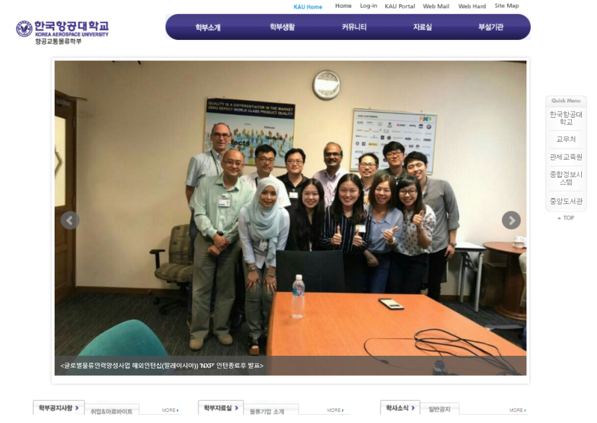
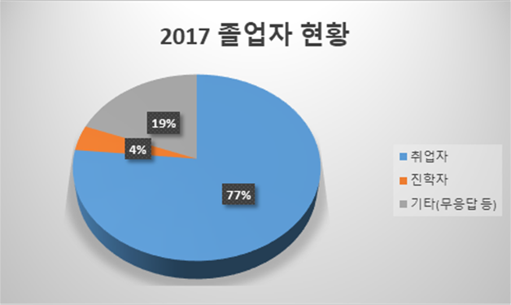
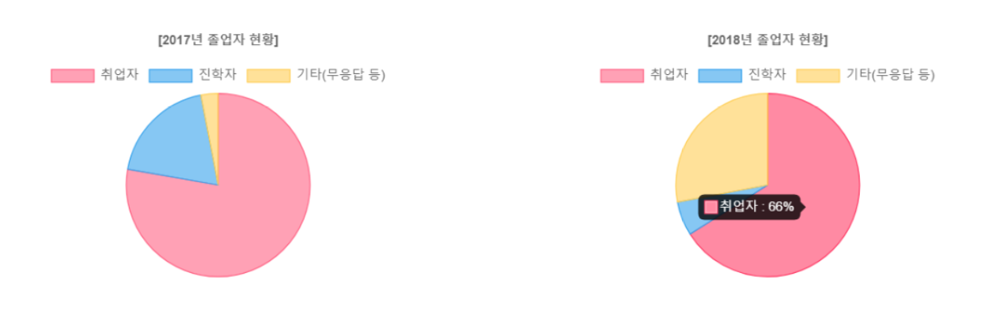
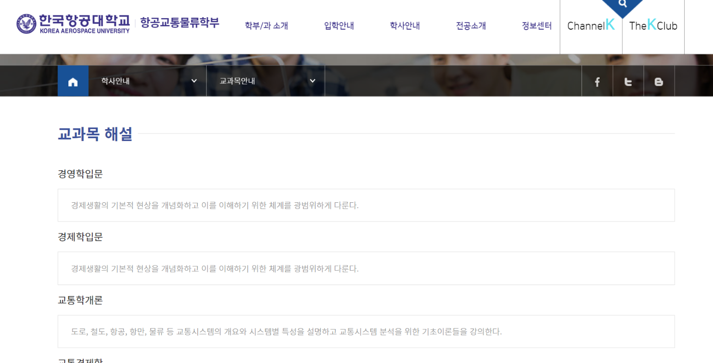
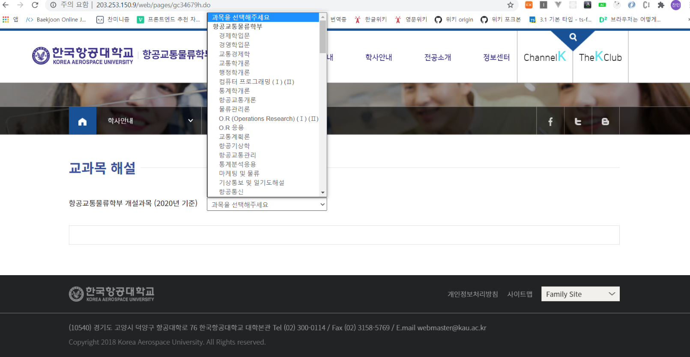

## 1. Prelude

전산실에서 근무하는 동기의 추천으로 8월 한달간 학부 홈페이지 재구축사업에 참여했다.  
지금까지 공부한 지식으로 돈을 벌 수 있다는게 너무 행복하게 느껴졌는데, 행복은 잠시뿐.  
곧이어 내가 맡게 된 쓰러지기 직전의 페이지를 보곤 탄식을 금할 수 없었다..




<div style = "margin: 1rem; font-size: 0.9rem; text-align: center;">[리뉴얼 전 홈페이지 대문]</div>


<div style = "margin: 1rem; font-size: 0.9rem; text-align: center;">[리뉴얼 후 홈페이지 대문]</div>

## 2. 업무내용

솔직히 일은 엄청 쉬웠다.
그냥 학부에서 받은 텍스트와 자료를 기반으로 템플릿에 내용을 추가하고, 세부 페이지는 HTML과 CSS를 적당히 사용해 꾸며주면 된다. ~~***월급루팡***~~

그러다 보니 내용을 추가하는 작업은 거의 일주일만에 끝났는데, 이후 남은 기간에는 어떻게 하면 사용자에게 더 편할지, 더 예쁠지 고민도 해보고 `transition` 이나 `position` 등 고급 CSS 효과들을 원없이 연습해볼 수 있었다.

작업들 중 크게 기억에 남는게 두 가지가 있었는데, 이 페이지들을 만들면서 겪은 일을 간단하게 소개해보려 한다.

- #### 졸업생 현황에 차트 삽입하기
- #### 교과목 해설 페이지 만들기

## 3. 차트 삽입하기




"졸업생 현황" 이라는 페이지를 제작할 때 위의 차트 이미지를 삽입해달라는 주문을 받았는데, 아무리 봐도 이걸 그대로 넣는 건 좋은 생각이 아닌 것 같아 차트 라이브러리를 사용하기로 했다. <span style = "font-size:0.85rem">(이왕 하는거 세련되게...)</span>

처음에는 예쁘다는 이유로 무턱대고 [TOAST UI](https://ui.toast.com/tui-chart/) 를 사용하려 했으나, 차트를 풍성하게 꾸미는 건 디자인이 아니라 결국 데이터라는걸 깨닫고 그냥 심플한 [Chart.js](https://www.chartjs.org/samples/latest/) 라는 오픈소스 라이브러리의 도넛 차트를 사용하기로 했다.

([D3.js](https://d3js.org/) 라는 라이브러리의 사용도 고려했지만 D3는 이런 단순한 차트가 아니라 데이터 사이언스에서 쓰일법한 차트가 대부분이었고, 개발 문서가 [TOAST UI](https://ui.toast.com/tui-chart/)나 [Chart.js](https://www.chartjs.org/samples/latest/)에 비해 빈약하다고 느껴져 [Chart.js](https://www.chartjs.org/samples/latest/)를 선택했다.)

#### [도넛 차트 코드]

```js
<script src="https://cdn.jsdelivr.net/npm/chart.js@2.8.0"></script>
<script>
let myChart2 = new Chart(ctx2, {
      type: "pie",
      data: {
        labels: ["취업자", "진학자", "기타(무응답 등)"],
        datasets: [
          {
            data: [66, 6, 28],
            backgroundColor: [
              "rgba(255, 99, 132, 0.6)",
              "rgba(54, 162, 235, 0.6)",
              "rgba(255, 206, 86, 0.6)",
            ],
            borderColor: [
              "rgba(255, 99, 132, 1)",
              "rgba(54, 162, 235, 1)",
              "rgba(255, 206, 86, 1)",
            ],
            borderWidth: 1,
          },
        ],
      },
      options: {
        title: { display: true, text: "[2018년 졸업자 현황]" },
        tooltips: {
          callbacks: {
            title: function (tooltipItems, data) {
              return "";
            },
            label: function (tooltipItem, data) {
              return `${data.labels[tooltipItem.index]} : ${
                data.datasets[0].data[tooltipItem.index]
              }%`;
            },
          },
        },
        legend: { display: true, onClick: null },
      },
    });
</script>
```
코드는 개발 문서를 참고하면서 예제를 적당히 수정해 얻을 수 있었다.

항상 `import` 나 `require` 문을 사용해 모듈을 끌어오다가 `<script src = "cdn상 모듈">` 를 사용해 모듈을 사용하는건 색다른 경험이었고, 차트가 모바일에서는 제대로 출력되지 않는 문제와 두 차트를 같은 선상에 출력하는 과정이 꽤 까다로웠다. ~~짱났다~~

---



<div style = "margin: 1rem; font-size: 0.9rem; text-align: center;">[졸업생 현황 페이지 차트]</div>

모바일에서 차트가 깨지는 문제는 미디어쿼리를 사용해 모바일 화면에서는 차트 부분이 아예 출력되지 않도록 했고, 차트 사이즈는 차트를 `display: inline-block` 스타일을 부여한 `<div>` 안에 담은 후, `<div>` 의 너비를 50%로 맞춰 두 개의 차트가 한 줄에 올 수 있도록 했다.

간단한 작업이었지만 [TOAST UI](https://ui.toast.com/tui-chart/)나 [D3.js](https://d3js.org/) 등 훌륭한 라이브러리를 사용해 자바스크립트로 데이터 시각화도 충분히 가능하다는 것을 느꼈고, 자바스크립트 활용 폭을 조금 더 넓힐 수 있게 되어 기억에 남는다.

## 4. 교과목 해설 페이지



<div style = "margin: 1rem; font-size: 0.9rem; text-align: center;">[교과목 해설 페이지 초안]</div>

항교물은 무려 3개의 학과가 합쳐진 학부다 보니 개설된 과목 수가 거의 100개(...) 에 육박했고, 이걸 위 사진처럼 한 페이지에 모두 담으면 `ctrl + f` 없이는 원하는 정보를 찾을 수 없을게 분명했다.

그래서 고민 끝에 드롭다운 메뉴를 만들고 과목을 선택하면 해당 과목만 표시해주는 기능을 만들어보기로 했고, 구글링 끝에 `<select>` 와 `<option>` 태그를 활용해 만들 수 있었다.



<div style = "margin: 1rem; font-size: 0.9rem; text-align: center;">[1차 개선 - 드롭다운]</div>

드롭다운 메뉴를 만들어 스크롤의 압박에서는 벗어날 수 있었지만, 또다른 문제와 개선사항이 생겼다.


#### [문제점]
 
> 1. 드롭다운 내에서 원하는 과목을 찾으려면 한참 내려야함
> 2. 못생김 **(아주 중요!!)**

#### [개선 가능점]

> 1. `autocomplete` 를 활용해 검색창에 "항공" 만 쳐도 "항공" 이라는 텍스트를 포함하는 과목을 모아볼 수 있도록
> 2. 어떻게 이걸 예쁘게 표현할 것인가

---

구글링 끝에 찾아낸 방법은 `dataList` 라는 생소한 태그를 사용하는 방법이었는데...

<div style = "text-align: right; margin: 2rem">다음 편으로 이어집니다.</div>