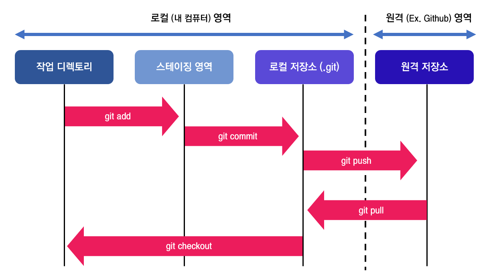

약 한 달간의 오픈소스 컨트리뷰톤이 끝나고 가장 유익했다고 생각되는 건 바로 Git 공부일 것이다.  
[LearnGitBranching](https://learngitbranching.js.org/?locale=ko) 이라는 사이트와 멘토님의 열혈 지도 덕분에 `rebase`와 `reflog` 등 정말 듣도보도 못한 새로운 기능들을 배울 수 있었는데, 이 좋은 걸 나만 알긴 아까우니 정리해보려 한다.

## 1. 깃의 기본

깃을 사용하는 목적은 코드의 버전 및 형상을 관리하기 위함이다.  
우선 용어를 간단하게 정리할 필요가 있는데 '로컬 저장소' 라 함은 기본적으로 내 로컬 프로젝트의 git 저장소를 의미하고, '원격 저장소' 라 하면 **GitHub** 등 네트워크 상의 git 저장소라고 생각하면 될 것이다.



<div style = "text-align: center; margin-bottom: 1rem; font-size: 0.8rem">원격에서 코드를 불러오는 부분은 fetch-rebase 조합을 사용하기도 한다.</div>

위 그림은 깃의 동작을 간단하게 그림으로 나타낸 것이다.  
스테이징 영역은 내 작업을 커밋하기 전에 잠깐 거쳐가는 곳으로, 이곳에서 어떤 파일을 커밋에 포함하고 제외할지 지정할 수 있다.  
> [둘러보면 좋은 글 : [git의 staging area는 어떤 점이 유용한가](https://blog.npcode.com/2012/10/23/git%EC%9D%98-staging-area%EB%8A%94-%EC%96%B4%EB%96%A4-%EC%A0%90%EC%9D%B4-%EC%9C%A0%EC%9A%A9%ED%95%9C%EA%B0%80/)]


### 1. 1. 변경사항이 존재하는 모든 코드 스테이징하기

```git
$ git add .
```

---

### 1. 2. 특정 폴더 또는 파일만을 스테이징하기

```git
$ git add [특정 파일 또는 폴더명]
# 파일은 확장자를 포함하며, 빈 폴더일 경우 스테이징이 불가능하다.
```

---

### 1. 3. 모든 스테이징 취소하기

```git
$ git reset
```

---

### 1. 4. 특정 폴더 또는 파일 스테이징 취소하기

```git
$ git reset [특정 파일 또는 폴더명]
```

## 2. 커밋 (commit)

스테이징까지 끝난 코드들은 본격적인 버전 관리를 위해 기록을 남겨야 하는데 이게 바로 '커밋'이다.  
커밋은 깃의 주인공이라고 해도 과언이 아닌데, 여기에는 파일 및 폴더의 수정 시간, 이전 커밋과 비교 후 변경 이력 등의 정보가 담기게 되며 깃을 다룰 때는 모든 작업을 코드가 아닌 `커밋`을 중심으로 생각해야 한다.  

따라서 보통 하나의 작업당 한 커밋만을 수행하는 것을 권장하고 커밋 메시지에는 작업한 내용이 드러나도록 한다.

> Ex. 기능이 다른 컴포넌트 A와 B의 수정 작업을 진행할 때

- 나쁜 커밋 메시지 예시 : 커밋 1 - "컴포넌트 A B 수정"
- 좋은 커밋 메시지 예시 : 커밋 1 - "컴포넌트 A 수정 - #[이슈번호]()", 커밋 2 - "컴포넌트 B 수정 - #[이슈번호]()"

이걸 언제나 지키는건 어렵더라도 남과 협업하는 프로젝트에서는 반드시 지키는 것을 권장한다.  

### 2. 1. 메시지를 포함한 커밋

```git
$ git commit -m "커밋 메시지"
# 닫는 큰따옴표가 나타나기 전까지 엔터키로 개행도 자유롭게 가능합니다.
```

---

### 2. 2. 커밋 메시지 수정하기

```git
$ git commit --amend
```

---

### 2. 3. 푸시 전 커밋 취소하기[^1]

```git
$ git reset --soft HEAD^
# 푸시하기 전 가장 최근 커밋과 스테이징을 취소합니다.
$ git reset --soft [커밋명^]
# 해당 커밋번호 이후의 모든 커밋과 스테이징을 취소합니다.
```

* 커밋명은 영문 + 숫자로 이루어진 40자리의 이름이 붙는데, 깃에서 커밋을 조작할 때는 앞(왼쪽)의 6자리만 떼어 사용해도 된다. <span style = "font-size: 0.88rem;">(Ex. 977814bfbde6a604e4e4605f9d4fe3494bc0fe82 -> 977814)</span>


## 3. 푸시 (push)

푸시는 내 커밋 기록을 원격 저장소에 추가할 때 사용한다.  
단, 푸시하고자 하는 원격 저장소가 존재하지 않으면 푸시가 불가능하다.

푸시 동작을 수행하면 로컬 저장소의 커밋 기록과 원격 저장소의 HEAD 커밋을 비교한 후, HEAD보다 앞에 있을 때(최신일 때) 푸시를 진행한다.


<div style = "text-align: center; margin-bottom: 1rem; font-size: 0.8rem">push 시에는 원격 저장소의 HEAD와 로컬 저장소의 커밋을 비교한다.</div>

### 3. 1. 특정 저장소 / 브랜치에 커밋 푸시하기[^2]

```git
$ git push [저장소명] [브랜치명]
```

---


### 3. 2. 특정 저장소 / 브랜치에 강제로 커밋 푸시하기

```git
$ git push -f [저장소명] [브랜치명]
```

- `push -f` 옵션은 원격 저장소를 로컬 저장소로 완전히 덮어쓴다.

- 매우 위험한 옵션으로 평소에는 사용이 권장되지 않으며, 주로 `interactive rebase` 시에 사용한다.

---

### 3. 3. 특정 저장소 / 브랜치를 기본 푸시 타겟으로 설정하고 푸시하기

```git
$ git push -u [저장소명] [브랜치명]
```

- `push -u` 옵션을 사용하면 이후에는 저장소/브랜치를 직접 지정할 필요 없이 `git push` 명령만으로 지정한 위치에 푸시한다.


[^1]: 위의 코드는 예시로, 실제 커밋명 입력 시 대괄호는 제외합니다.
[^2]: 위의 코드는 예시로, 실제 저장소-브랜치명 입력 시 대괄호는 제외합니다.