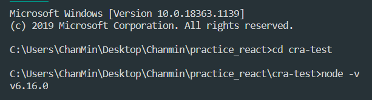
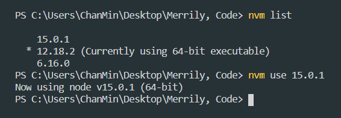
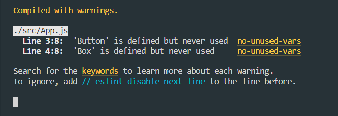

## 1. 사건의 발단

```js
import React, { useState } from 'react'

export default function TodoList() {
  const [todos, setTodos] = useState([])
  const onClick = () => {
    import('./Todo.js').then(({ Todo }) => {
      const position = todos.length + 1
      const newTodo = <Todo key={position} title={`할 일 ${position}`} />
      setTodos([...todos, newTodo])
    })
  }
  return (
    <div>
      <button onClick={onClick}>할 일 추가</button>
      {todos}
    </div>
  )
}
```

동적 임포트를 사용한 코드 스플리팅을 배우고 있었다.  
처음 배우는 개념이라 설레는 마음으로 `npm start` 를 실행했지만 역시 이런건 한번에 되는 법이 없다.


아무래도 동적 임포트 부분이 문제였던 것 같은데.. 치솟는 분노를 뒤로 하고 스택오버플로에 검색한 결과 옛날 노드(Node.js) 버전에서는 `async/await` 기능을 지원하지 않아 생긴 문제임을 알 수 있었다.

그런데 잠깐! 나는 분명 노드 12 버전을 사용하고 있을 텐데? 뭔가 이상했다.

그래서 `node -v` 로 현재 노드 버전을 확인한 결과 웬 노드 6.16버전이 출력되는 것을 확인할 수 있었다.



여기서 한가지 팁을 적자면 터미널에 `nvm` 을 입력하면 노드를 관리할 수 있는 여러 항목이 나타난다.

그 중에서도 `nvm install <버전> [운영체제 bit]` 를 입력하면 원하는 버전의 노드를 설치할 수 있는데 나는 `nvm install latest 64` 라는 명령어를 통해 64비트용 최신 노드를 설치했다.



또 노드를 설치만 하면 끝나는 게 아니라 내가 사용할 노드의 버전을 정해줘야 하는데, 이건 `nvm list` 라는 명령어로 설치된 노드들을 확인하고 `nvm use (사용할 버전)` 을 입력하면 된다.

아무튼! 노드 버전을 6에서 원래 사용하던 12.18로 되돌리니 모든 문제를 해결할 수 있었다 😙



## 2. 요약

`nvm` 은 노드 버전 관리용 소프트웨어로, 현재 환경에 설치된 노드를 관리할 수 있다.

- 사용중인 노드 버전 확인 명령어 : `node -v`

- 노드 설치 명령어 : `nvm install <버전> [OS 비트]`

- 설치된 노드 목록 확인 명령어 : `nvm list`

- 특정 버전의 노드 사용 명령어 : `nvm use <버전>`
