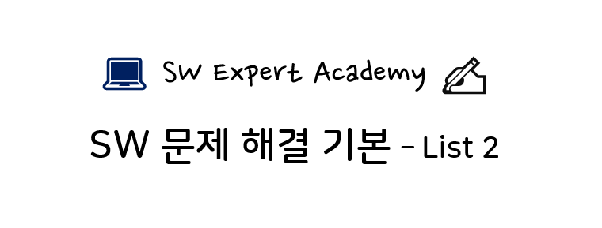

- 모든 문제의 저작권은 SW Expert Academy에 있습니다.

## 문제 목록

> [D2] No. 4836 색칠하기

## 풀이 코드 (Python)

### 1. 4836번 - 색칠하기

- 1이 빨강, 2가 파랑이니 합이 3만 넘으면 보라겠지? 라는 생각이 함정입니다.
- 빨강 영역만 셋이 겹칠때도 합이 3이 된다는 사실을 잊지 마세요.

```python
T = int(input())
for i in range(1, T + 1):
    N = int(input())
    cnt = 0
    canvas = [[0] * 10 for _ in range(10)]
    for j in range(N):
        top, left, bottom, right, color = map(int, input().split())
        for row in range(top, bottom+1):
            for col in range(left, right+1):
                if canvas[row][col] is color:
                    continue
                else:
                    canvas[row][col] += color
    for row in range(10):
        for col in range(10):
            if canvas[row][col] >= 3:
                cnt += 1

    print("#{} {}".format(i, cnt))
```
